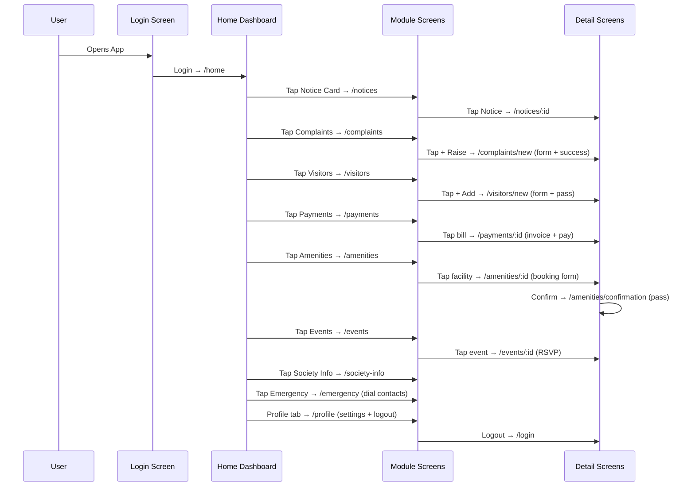

# SocietyHub — Complete System Flow & Screen Reference

> **App**: SocietyHub — "Everything about your society, in one place."
> **Society**: Green Valley Residency | **Resident**: Vaivasvat Mathur | **Flat**: B-204, Block B, 2nd Floor

---

## App Architecture Overview

```mermaid
flowchart TD
    A[/login] -->|Authenticated| B[/home]
    B --> C[/notices]
    B --> D[/complaints]
    B --> E[/visitors]
    B --> F[/payments]
    B --> G[/amenities]
    B --> H[/events]
    B --> I[/society-info]
    B --> J[/emergency]
    C --> C1[/notices/:id]
    D --> D1[/complaints/new]
    E --> E1[/visitors/new]
    F --> F1[/payments/:id]
    G --> G1[/amenities/:id]
    G --> G2[/bookings]
    G1 --> G3[/amenities/confirmation]
    H --> H1[/events/:id]
    K[/profile] --> K1[/profile/personal]
    K --> K2[/profile/flat]
    K --> K3[/payments]
    K --> K4[/bookings]
    K --> K5[/society-info]
    K --> K6[/emergency]
    K --> K7[/support]
    B -.->|Bottom Nav| C
    B -.->|Bottom Nav| D
    B -.->|Bottom Nav| E
    B -.->|Bottom Nav| K
```

---

## Navigation Structure

The app has two navigation layers:

| Layer | Component | Description |
|---|---|---|
| **Bottom Navigation** (Floating Pill) | `BottomNavigation.jsx` | Always visible on main screens. 5 tabs: Home, Notices, Complaints, Visitors, Profile |
| **App Header** | `AppHeader.jsx` | Top header with title, subtitle, optional back button, and right action button |

---

## Screen-by-Screen Flow

---

### 1. 🔐 Login Screen
**Route**: `/login`  **File**: [`Login.jsx`](file:///c:/Users/Vaivasvat%20Mathur/OneDrive/Desktop/Society%20Hub/src/pages/Login.jsx)

**Purpose**: Authentication entry point. Shown to unauthenticated users. All other routes are protected.

**What's on screen:**
- **SocietyHub branding** — `Building2` icon in a dark navy rounded tile + app name + tagline
- **Login form card** — white rounded card with:
  - Mobile Number field (pre-filled: `9876512345`)
  - Password field (pre-filled: `••••••••`)
  - "Forgot password?" link → shows browser alert
  - **"Login to Society →"** primary CTA button
- **Footer** — "Don't have an account? Sign up" link (shows alert directing user to society office) + Green Valley Residency official portal label with `Shield` icon

**User Flow**:
1. User enters mobile number + password
2. Taps "Login to Society"
3. Validated → `login()` called in AppContext → navigated to `/home`
4. Invalid (< 10 digits) → inline error shown

---

### 2. 🏠 Home Screen
**Route**: `/home`  **File**: [`Home.jsx`](file:///c:/Users/Vaivasvat%20Mathur/OneDrive/Desktop/Society%20Hub/src/pages/Home.jsx)

**Purpose**: Main dashboard. Central hub that surface-level shows all society activity.

**What's on screen (top to bottom):**

#### A. Residential Banner (ResidentialBanner component)
- Society photograph of Green Valley Residency (real image from `/public/assets/society.jpg`)
- Society name: **Green Valley Residency**
- Flat badge: **B-204** (emerald monospace badge)
- Flat details: Block B • 2nd Floor
- "Details →" link → navigates to `/profile/flat`
- Bell icon (top right) → notifications

#### B. Pending Maintenance Bill Alert Strip *(conditional)*
- Shown only if there is a `Pending` payment
- Amber-tinted alert with `ReceiptText` icon
- Shows: "Maintenance Bill Due • ₹X,XXX" + due date + month
- "Pay Now →" button → navigates to `/payments`

#### C. Important Announcement Card
- Dark navy card with `Megaphone` icon badge
- Shows the most important/unread society notice
- Title + date/timestamp with `Clock` icon
- Truncated summary text
- "View Notice →" button → navigates to `/notices/:id`

#### D. 4×2 Services & Modules Grid
8 quick-access icon buttons, each navigating to a module:

| Icon | Label | Route | Color |
|---|---|---|---|
| `FileText` | Notices | `/notices` | Emerald |
| `AlertCircle` | Complaints | `/complaints` | Amber |
| `Users` | Visitors | `/visitors` | Blue |
| `CreditCard` | Payments | `/payments` | Purple (+ Due badge if pending) |
| `Dumbbell` | Amenities | `/amenities` | Teal |
| `Calendar` | Events | `/events` | Indigo |
| `Building2` | Society Info | `/society-info` | Slate |
| `PhoneCall` | Emergency | `/emergency` | Rose |

#### E. Upcoming Event Card
- Section header with `Calendar` icon + "View Calendar →" link to `/events`
- Shows `events[0]` — event name, time (`Clock` icon), venue (`MapPin` icon)
- RSVP status badge ("Going ✓" or "RSVP")
- Tap → navigates to `/events/:id`

#### F. Gate Security Helpline Strip
- `PhoneCall` icon
- "Gate Security Desk Intercom: #204" + "Main Gate: +91 22 2780 1200"
- "Helplines →" link → navigates to `/emergency`

#### G. Floating Bottom Navigation
- 5 tabs: Home (active), Notices, Complaints, Visitors, Profile

---

### 3. 📋 Society Notices
**Route**: `/notices`  **File**: [`Notices.jsx`](file:///c:/Users/Vaivasvat%20Mathur/OneDrive/Desktop/Society%20Hub/src/pages/Notices.jsx)

**Purpose**: Browse and filter all society announcements and notices.

**What's on screen:**
- **Header**: "Society Notices" + unread count subtitle + `Search` icon button (right)
- **Search bar** *(toggleable)*: Full-text search across title, summary, content with live filtering + clear `X` button
- **Filter chips** (horizontal scrollable): `All` | `Important` | `Maintenance` | `Events`
- **Notice cards list**: Each card navigates to `/notices/:id`
- **Empty state**: Bell icon + "No notices found" message if filter returns zero results

**Filtering logic**:
- "Important" → items where `isImportant === true`
- Other filters → match `item.category` case-insensitively
- Search → match `title`, `summary`, or `content`

**User Flow**:
1. User taps Notices from bottom nav or Home grid
2. Sees all notices sorted by recency
3. Can filter by category or search by keyword
4. Taps a notice card → Notice Details screen

---

### 3a. 📄 Notice Details
**Route**: `/notices/:id`  **File**: [`NoticeDetails.jsx`](file:///c:/Users/Vaivasvat%20Mathur/OneDrive/Desktop/Society%20Hub/src/pages/NoticeDetails.jsx)

**Purpose**: Full text view of a single notice.

**What's on screen:**
- App header with back button + notice title
- Category badge + "Important" badge if applicable
- Posted date and timestamp
- Full notice content body
- Applicable blocks/wings info

---

### 4. ⚠️ Complaints
**Route**: `/complaints`  **File**: [`Complaints.jsx`](file:///c:/Users/Vaivasvat%20Mathur/OneDrive/Desktop/Society%20Hub/src/pages/Complaints.jsx)

**Purpose**: Track all maintenance complaints/service tickets raised by the resident.

**What's on screen:**
- **Header**: "My Complaints" + total ticket count + green **"+ Raise"** button → `/complaints/new`
- **Filter chips with counts**: `All (n)` | `Open (n)` | `In Progress (n)` | `Resolved (n)`
- **Complaint cards list**: Each card shows ticket ID, title, category, status badge, date
- **Empty state**: AlertCircle icon + message if filter returns nothing
- **Ticket Detail Bottom Sheet** *(slide-up modal)*: Tapping a card reveals a bottom drawer with full details:
  - Ticket ID (monospace badge), title, status
  - Category, Date Raised, Location, Priority Level
  - Issue description paragraph
  - "Close Ticket View" button

**User Flow**:
1. User taps "Complaints" from bottom nav
2. Sees all tickets with status filter
3. Taps a card → bottom sheet slides up with details
4. Taps "Raise" button → Raise Complaint screen

---

### 4a. 📝 Raise a Complaint
**Route**: `/complaints/new`  **File**: [`RaiseComplaint.jsx`](file:///c:/Users/Vaivasvat%20Mathur/OneDrive/Desktop/Society%20Hub/src/pages/RaiseComplaint.jsx)

**Purpose**: Form to submit a new maintenance complaint ticket.

**What's on screen (Form):**
- **Category** dropdown: Plumbing | Electrical | Maintenance | Security | Cleaning | Other
- **Title** text field (required, with validation)
- **Description** textarea (required, with validation)
- **Location** text field (pre-filled with `Flat B-204`, with `MapPin` icon)
- **Priority** 3-button selector: `○ Low` | `● Medium` | `● High` (color-coded)
- **Attachment** — simulated photo attach toggle (shows `Camera` icon, toggles between "Add Photo" and "✓ Photo attached")
- **"Submit Complaint"** primary CTA button

**After Submission (Success State):**
- Animated `CheckCircle2` icon with bounce
- "Complaint Submitted" heading
- Generated Ticket summary card: Ticket ID | Category | Title | Status (Open) | Date
- "View My Complaints" button → navigates back to `/complaints`

---

### 5. 👥 Visitors
**Route**: `/visitors`  **File**: [`Visitors.jsx`](file:///c:/Users/Vaivasvat%20Mathur/OneDrive/Desktop/Society%20Hub/src/pages/Visitors.jsx)

**Purpose**: Pre-approve visitors for gate entry and view visitor history log.

**What's on screen:**
- **Header**: "Visitors" + total entry count + green **"+ Add"** button → `/visitors/new`
- **Quick Pre-Approve banner**: White card — "Expecting guest or delivery?" + "Add Visitor" dark button
- **Upcoming Visitors** section (`Clock3` icon): Cards for visitors with `status === 'Expected'`
- **Recent Visitor History** section (`UserCheck` icon): Cards for all past visitors
- Each `VisitorCard` shows: visitor name, phone, purpose, date/time, status badge

**User Flow**:
1. User taps "Visitors" from bottom nav
2. Sees upcoming pre-approved visitors at top, past visitors below
3. Taps "Add" or pre-approve banner → Add Visitor screen

---

### 5a. ➕ Add Visitor (Pre-Approve)
**Route**: `/visitors/new`  **File**: [`AddVisitor.jsx`](file:///c:/Users/Vaivasvat%20Mathur/OneDrive/Desktop/Society%20Hub/src/pages/AddVisitor.jsx)

**Purpose**: Create a gate entry pre-approval pass for a guest, delivery, or service professional.

**What's on screen (Form):**
- **Visitor Name** text field (`User` icon, required)
- **Phone Number** field (`Phone` icon, 10-digit validation)
- **Purpose of Visit** dropdown: `Guest` | `Delivery` | `Service` | `Other`
- **Visit Date** + **Arrival Time** (side-by-side 2-column fields, pre-filled with "Today" + "7:30 PM")
- **"Create Visitor Pass"** primary CTA

**After Submission (Visitor Pass Screen):**
- `CheckCircle2` animated icon
- "Visitor Pass Ready" heading
- `PassCard` component with:
  - Visitor name, phone, purpose
  - Date + time
  - Unique pass code / reference
- "Return to Visitor Log" button → `/visitors`

---

### 6. 💳 Payments
**Route**: `/payments`  **File**: [`Payments.jsx`](file:///c:/Users/Vaivasvat%20Mathur/OneDrive/Desktop/Society%20Hub/src/pages/Payments.jsx)

**Purpose**: View and pay monthly maintenance bills. See full payment history.

**What's on screen:**
- **Header**: "Maintenance & Payments" with back button

#### Pending Bill Hero Card *(if pending)*
- Dark navy full-width card
- "Pending Due" amber badge + due date
- Month label (e.g., "September 2026 Maintenance")
- **₹X,XXX** amount in large bold font
- "View Invoice Breakdown" link + **"Pay Now"** green button → `/payments/:id`

#### All Paid Card *(if no pending)*
- Green hero card with `CheckCircle` icon
- "All Maintenance Bills Paid!"

#### Payment History list
- All payment records (paid + pending)
- Each row: month, amount, paid date / due date, Paid/Pending status badge
- Tap any row → Payment Details screen

---

### 6a. 🧾 Payment / Invoice Details
**Route**: `/payments/:id`  **File**: [`PaymentDetails.jsx`](file:///c:/Users/Vaivasvat%20Mathur/OneDrive/Desktop/Society%20Hub/src/pages/PaymentDetails.jsx)

**Purpose**: Full invoice breakdown + payment gateway for pending bills, or receipt for paid bills.

**What's on screen:**
- **Invoice Summary card**:
  - Invoice No. (monospace), status badge (Paid/Pending)
  - Month + Total amount (₹X,XXX in large bold)
  - Flat B-204 + society name (right side)
  - If paid: green box showing Paid On, Method, Transaction ID

- **Itemized Charge Breakdown** card:
  - Line items (e.g., Maintenance, Water Charges, Lift AMC, Sinking Fund, etc.)
  - **Total Amount Due** bold line at bottom

- **Payment Method Selector** *(only if pending)*:
  - Radio button rows:
    - UPI (Google Pay / PhonePe / Paytm)
    - Net Banking (HDFC / ICICI / SBI)
    - Credit / Debit Card

- **Sticky Bottom CTA**:
  - Pending: **"Pay ₹X,XXX via UPI"** button (shows "Processing Payment..." during 800ms animation)
  - Paid: **"Download Official PDF Receipt"** button (shows toast confirmation)

---

### 7. 🏋️ Amenities
**Route**: `/amenities`  **File**: [`Amenities.jsx`](file:///c:/Users/Vaivasvat%20Mathur/OneDrive/Desktop/Society%20Hub/src/pages/Amenities.jsx)

**Purpose**: Browse and book society common area facilities (clubhouse, gym, courts, etc.)

**What's on screen:**
- **Header**: "Facility Amenities" + "Book common clubhouse facilities" subtitle + **"My Bookings"** button → `/bookings`
- **Category filter pills** (horizontal scroll): `All` | `Sports` | `Events & Gatherings` | `Recreation` | `Health & Fitness`
- **Amenities grid** (1-column cards): Each `AmenityCard` shows:
  - Facility name, category badge, booking fee
  - Location, timings, capacity
  - Availability status
- Tap card → Amenity Details screen

---

### 7a. 🏛️ Amenity Details & Booking
**Route**: `/amenities/:id`  **File**: [`AmenityDetails.jsx`](file:///c:/Users/Vaivasvat%20Mathur/OneDrive/Desktop/Society%20Hub/src/pages/AmenityDetails.jsx)

**Purpose**: View full facility info and book a time slot.

**What's on screen:**
- **Main Info card**: Category badge + booking fee (right), facility name, description, location/timings/capacity metadata row
- **Usage Rules & Guidelines card**: `ShieldAlert` icon + bullet list of rules
- **Slot Selection Form**:
  - **Booking Date** dropdown (Today, Tomorrow, Sat, Sun)
  - **Available Time Slots** — selectable button list (e.g., 6:00 PM – 9:00 PM), selected slot gets green tick + brand border
  - **Event/Booking Note** text input (e.g., "Birthday Party")
- **Sticky bottom CTA**: "Confirm & Reserve [Facility] Slot" → triggers booking + navigates to confirmation

---

### 7b. ✅ Booking Confirmation
**Route**: `/amenities/confirmation`  **File**: [`BookingConfirmation.jsx`](file:///c:/Users/Vaivasvat%20Mathur/OneDrive/Desktop/Society%20Hub/src/pages/BookingConfirmation.jsx)

**Purpose**: Success screen shown after a facility booking is confirmed.

**What's on screen:**
- Animated `CheckCircle2` icon
- "Booking Confirmed!" heading
- **Digital Booking Pass Card** (dark navy):
  - Booking Ref (monospace badge)
  - Facility name + booking purpose
  - QR Code icon (visual placeholder)
  - Resident name + flat, Date, Slot Time, Fee Paid

- **Actions**:
  - "Save Booking Pass" secondary button (shows toast)
  - "View My Bookings" CTA → `/bookings`

---

### 7c. 📅 My Bookings
**Route**: `/bookings`  **File**: [`MyBookings.jsx`](file:///c:/Users/Vaivasvat%20Mathur/OneDrive/Desktop/Society%20Hub/src/pages/MyBookings.jsx)

**Purpose**: View all past and upcoming facility reservations.

**What's on screen:**
- **Header**: "My Bookings" + reserved slot count + **"+ Book"** button → `/amenities`
- **Booking cards list**: Each card shows:
  - Booking reference (monospace badge) + status (Confirmed / Completed)
  - Facility name + purpose note
  - Date (`Calendar` icon) + time slot (`Clock` icon) in a 2-column info box
  - Fee amount + **"Cancel Slot"** button (for upcoming, not past bookings) — triggers `cancelBooking()`
- **Empty state**: Calendar icon + "No facility bookings" + "Browse Facilities" button

---

### 8. 🎉 Society Events
**Route**: `/events`  **File**: [`Events.jsx`](file:///c:/Users/Vaivasvat%20Mathur/OneDrive/Desktop/Society%20Hub/src/pages/Events.jsx)

**Purpose**: Browse all society events and RSVP.

**What's on screen:**
- **Header**: "Society Events" with back button
- **Category filter pills**: `All` | `Cultural Celebration` | `Society Governance` | `Sports & Kids` | `Community Welfare`
- **Event cards list**: Each `EventCard` shows:
  - Event title, category, date, time, venue
  - **RSVP button** (toggleable — tapping calls `toggleRSVP(id)`)
  - "Going ✓" badge when RSVPed
- Tap card → Event Details screen

---

### 8a. 📅 Event Details
**Route**: `/events/:id`  **File**: [`EventDetails.jsx`](file:///c:/Users/Vaivasvat%20Mathur/OneDrive/Desktop/Society%20Hub/src/pages/EventDetails.jsx)

**Purpose**: Full details of a single event.

**What's on screen:**
- App header with back button + event name
- Event category badge, date, time, venue
- Full event description
- Organizer info
- RSVP action button

---

### 9. 🏢 Society Information
**Route**: `/society-info`  **File**: [`SocietyInfo.jsx`](file:///c:/Users/Vaivasvat%20Mathur/OneDrive/Desktop/Society%20Hub/src/pages/SocietyInfo.jsx)

**Purpose**: Official society directory and institutional information.

**What's on screen:**

#### Hero Society Card (dark navy)
- `Building` icon badge + society tagline
- **Green Valley Residency** name (bold, large)
- Full address with `MapPin` icon
- Registration No. + RERA Registration (monospace)

#### Campus & Infrastructure Overview
- Towers count, Total Flats, Campus Size (e.g., 4 Towers, 288 Apartments, 3.2 Acres)

#### Society Estate Office Timings
- Mon–Sat hours, Sunday closed, etc.

#### Managing Committee Members
- Role badge (President, Secretary, Treasurer, etc.)
- Member name + Flat number
- **"Call"** button → `tel:` link for direct call

---

### 10. 🚨 Emergency Contacts
**Route**: `/emergency`  **File**: [`EmergencyContacts.jsx`](file:///c:/Users/Vaivasvat%20Mathur/OneDrive/Desktop/Society%20Hub/src/pages/EmergencyContacts.jsx)

**Purpose**: One-tap emergency and helpline dialing directory.

**What's on screen:**

#### 24×7 Gate Desk Hero Banner (rose/red)
- `ShieldAlert` icon
- "24x7 Society Gate Desk" + phone number
- **"Dial Gate"** button → `tel:02227801200`

#### 1-Tap Helplines & On-Call Technicians
- Scrollable list of contacts (e.g., Fire Safety, Lift Rescue, Plumbing, Electrical, etc.)
- Each row: tag badge (Emergency / Urgent / Normal) + title + subtitle + phone number
- **"Call"** button → `tel:` link

---

### 11. 👤 Profile & Account
**Route**: `/profile`  **File**: [`Profile.jsx`](file:///c:/Users/Vaivasvat%20Mathur/OneDrive/Desktop/Society%20Hub/src/pages/Profile.jsx)

**Purpose**: User account hub, settings, and quick links to personal/flat details.

**What's on screen:**

#### Resident Card
- Avatar initials (dark navy tile) + Name + "Owner" badge
- Flat B-204 • Block B
- Society name

#### Menu Sections (grouped list with chevrons):

| Section | Items |
|---|---|
| **Account** | Personal Information → `/profile/personal` |
| | Flat & Parking Details → `/profile/flat` |
| | My Maintenance Bills → `/payments` |
| | My Facility Bookings → `/bookings` |
| **Society Directory** | Society Information → `/society-info` |
| | Emergency Contacts → `/emergency` |
| **Preferences** | Push Notifications (toggle checkbox — fires toast on change) |
| | App Language (shows "English" detail, fires toast) |
| **Support & Legal** | Help & Support → `/support` |
| | Privacy Policy & RERA → `/support` |

#### Logout Button
- Rose-colored "Logout from App" button with `LogOut` icon
- Shows `window.confirm()` dialog → on confirm calls `logout()` + navigates to `/login`

---

### 11a. 👤 Personal Information
**Route**: `/profile/personal`  **File**: [`PersonalInfo.jsx`](file:///c:/Users/Vaivasvat%20Mathur/OneDrive/Desktop/Society%20Hub/src/pages/PersonalInfo.jsx)

**Purpose**: View and edit personal profile details.

**What's on screen:**
- Editable fields: Full Name, Mobile Number, Email, Emergency Contact, Occupation
- Owner/Tenant tag
- Save changes button

---

### 11b. 🏠 Flat & Parking Details
**Route**: `/profile/flat`  **File**: [`FlatDetails.jsx`](file:///c:/Users/Vaivasvat%20Mathur/OneDrive/Desktop/Society%20Hub/src/pages/FlatDetails.jsx)

**Purpose**: Full flat registration and parking details.

**What's on screen:**
- Flat No: B-204, Block B, 2nd Floor
- Configuration: 3 BHK, 1,650 sq. ft.
- Parking slot number
- Society share certificate number
- Possession date
- Ownership type

---

### 12. 🔔 Notifications
**Route**: `/notifications`  **File**: [`Notifications.jsx`](file:///c:/Users/Vaivasvat%20Mathur/OneDrive/Desktop/Society%20Hub/src/pages/Notifications.jsx)

**Purpose**: In-app notification center showing all alerts, notices, and reminders.

**What's on screen:**
- App header "Notifications"
- Grouped notification list (Today, Earlier)
- Each notification: icon, title, message, time
- Read/unread visual distinction

---

### 13. ❓ Help & Support
**Route**: `/support`  **File**: [`HelpSupport.jsx`](file:///c:/Users/Vaivasvat%20Mathur/OneDrive/Desktop/Society%20Hub/src/pages/HelpSupport.jsx)

**Purpose**: FAQ and contact details for app/society support.

**What's on screen:**

#### Contact App Support Desk
- `Mail` icon section
- "For technical queries..." explanation text
- Support Email: `support@societyhub.app`
- Estate Manager Line: `+91 22 2780 1201`

#### Frequently Asked Questions (Accordion)
4 FAQs with toggle expand/collapse (`ChevronDown` / `ChevronUp`):
1. How to add a visitor for gate pre-approval?
2. When is society maintenance due?
3. How to book the Clubhouse or Badminton Court?
4. What to do if a complaint ticket is delayed?

Each answer reveals inside a subtle card on expand.

#### Privacy & Security Compliance
- `ShieldCheck` icon
- RERA & Maharashtra Co-operative Societies Act compliance notice

---

## Complete User Journey Map



---

## Global UI Patterns

| Pattern | Description |
|---|---|
| **Toast Notifications** | Short floating pill at top center — shows success/info messages (e.g., "Payment successful", "Notifications muted") |
| **Protected Routes** | All routes except `/login` require authentication via `AppContext.isAuthenticated` |
| **Active Press** | All interactive elements use `active-press` class for tactile press feedback |
| **Floating Bottom Nav** | Glassmorphic pill navbar floating 12–18px above bottom, 90% viewport width, `backdrop-blur-xl` |
| **Filter Chips** | Horizontal scrollable chip bars for category filtering on list screens |
| **Bottom Sheet Modal** | Slide-up drawer used on Complaints for ticket details |
| **Empty States** | All list screens show an empty state illustration + message when no data matches |
| **Sticky CTAs** | Payment and Amenity booking screens have sticky bottom CTA bars that float above content |
